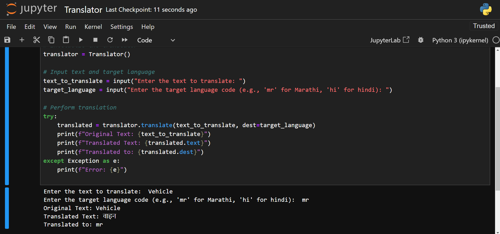

# 🌍 Language Translator 🔤

A Python-based language translation tool leveraging the Google Translate API. Users can input text and specify a target language code to receive accurate translations instantly. This project is ideal for quick language conversions and understanding multilingual text. It is simple, efficient, and designed for ease of use.

## Key Features

- **Text Translation**: Translate text to any supported language using the Google Translate API.
- **User Input**: The program asks the user for text and the target language code.
- **Real-time Translation**: Provides fast and accurate translations in real-time.

## Screenshots



## Libraries Used

- `googletrans==4.0.0-rc1`: A Python library that provides an interface to the Google Translate API.
- `Python`: The programming language used to implement this project.

## Setup

1. **Clone the repository**:
   ```bash
   git clone https://github.com/sanketjadhav09/Language-Translator.git
   cd translator-project
   ```

2. **Install the required dependencies**:
   ```bash
   pip install googletrans==4.0.0-rc1
   ```

3. **Run the program**:
   ```bash
   Language_Translator.ipynb
   ```

## How to Use

1. After running `Language_Translator.ipynb`, the program will prompt you to enter the text you wish to translate.
2. You will then be asked to provide the target language code (e.g., 'mr' for Marathi, 'hi' for hindi).
3. The program will display the original text, the translated text, and the language it was translated to.

## Project Structure

- `Language_Translator.ipynb`: Main Python script handling user input, translation request, and output display.
- `README.md`: This file, containing instructions and project details.
- `Output.png`: A screenshot of the translator in action.

## How It Works

1. **User Input**: The user is prompted to input text and specify the target language code.
2. **API Call**: The program sends the input to the Google Translate API, requesting a translation.
3. **Output**: The program displays the translated text and language information.

## License

This project is an open-source and available under the [MIT LICENSE](LICENSE).

## Acknowledgements and Contributions  

- Special thanks to **my mentors** for their guidance and support throughout the development of this project.  
- This project was completed in a **Jupyter Notebook Environment**, which provided an interactive and efficient platform for implementation.  
- **Contributions are welcome!** If you have ideas for improvements or additional features, feel free to fork the repository, make changes, and submit a pull request. Your contributions are greatly appreciated!
